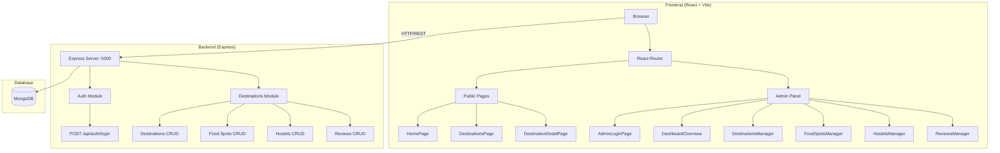
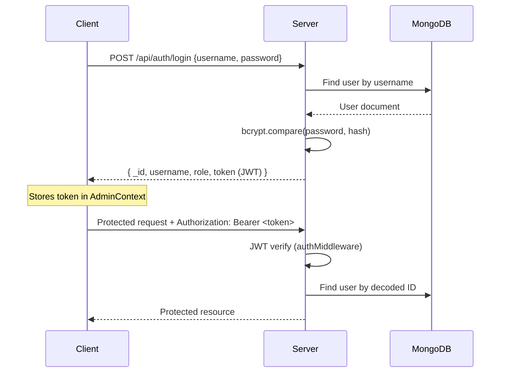

# 📋 Experience India – Destination Explorer | Detailed Project Report

**Project Title:** Experience India – Destination Explorer  
**Type:** Full-Stack Web Application  
**Architecture:** Monorepo  
**Date:** March 13, 2026

---

## 1. Project Overview

A full-stack web application for **exploring and managing travel destinations across India**. Users can browse curated destinations, view ratings, read reviews, and discover nearby food spots and hostels. An **admin panel** provides complete content management with CRUD operations, search, filtering, and a review moderation system.

---

## 2. Technology Stack

### Frontend (`apps/client`)

| Technology | Version | Purpose |
|---|---|---|
| React | 19.2.0 | UI library |
| TypeScript | ~5.9.3 | Type safety |
| Vite | 7.2.4 | Build tool & dev server |
| Tailwind CSS | 3.4.19 | Utility-first styling |
| React Router DOM | 7.13.0 | Client-side routing |
| Radix UI | Various | Accessible headless UI primitives |
| Lucide React | 0.562.0 | Icon library |
| GSAP | 3.14.2 | Animations |
| Recharts | 2.15.4 | Dashboard charts |
| Zod | 4.3.5 | Schema validation |
| React Hook Form | 7.70.0 | Form management |
| Sonner | 2.0.7 | Toast notifications |

### Backend (`apps/server`)

| Technology | Version | Purpose |
|---|---|---|
| Node.js | 18+ | Runtime |
| Express | 4.19.2 | Web framework |
| MongoDB (Mongoose) | 8.2.4 | Database & ODM |
| JWT (jsonwebtoken) | 9.0.2 | Authentication tokens |
| bcryptjs | 2.4.3 | Password hashing |
| dotenv | 16.4.5 | Environment variables |
| Nodemon | 3.1.0 | Dev hot-reloading |

### DevOps

| Technology | Purpose |
|---|---|
| Docker Compose | Multi-container orchestration |
| npm Workspaces | Monorepo dependency management |

---

## 3. System Architecture



---

## 4. Project Directory Structure

```
experinace india/
└── app/
    ├── package.json              # Root workspace config
    ├── docker-compose.yml        # Docker orchestration
    ├── README.md                 # Project documentation
    ├── ADMIN_PANEL_FEATURES.md   # Admin feature specs
    ├── TESTING_GUIDE.md          # Testing documentation
    └── apps/
        ├── client/               # React Frontend
        │   ├── src/
        │   │   ├── app/          # App entry (App.tsx, main.tsx, providers/)
        │   │   ├── features/     # Feature modules
        │   │   │   ├── admin/    # Admin panel pages (6 components)
        │   │   │   ├── auth/     # Authentication (2 components)
        │   │   │   ├── destinations/  # Destination pages (2 components)
        │   │   │   └── home/     # Homepage sections (5 components)
        │   │   └── shared/       # Shared resources
        │   │       ├── ui/       # 59 reusable UI components
        │   │       ├── data/     # Static data (destinations.ts)
        │   │       ├── hooks/    # Custom hooks (use-mobile.ts)
        │   │       ├── types/    # TypeScript type definitions
        │   │       └── utils/    # Utility functions
        │   ├── tailwind.config.js
        │   ├── vite.config.ts
        │   └── tsconfig.json
        └── server/               # Node.js Backend
            ├── src/
            │   ├── server.js     # Express app entry point
            │   ├── config/       # Database connection (db.js)
            │   ├── middlewares/  # Auth middleware (JWT verification)
            │   ├── modules/
            │   │   ├── auth/     # User model + login route
            │   │   └── destinations/  # Destination model + all routes
            │   └── seed/         # Seed data scripts
            ├── .env              # Environment variables
            └── package.json
```

---

## 5. Database Schema Design

The project uses **MongoDB** with **Mongoose ODM** and an **embedded document** pattern.

### User Model (`auth/model.js`)

| Field | Type | Constraints |
|---|---|---|
| `username` | String | Required, Unique |
| `password` | String | Required, Auto-hashed (bcrypt, salt 10) |
| `role` | String | Default: `"admin"` |
| `timestamps` | Auto | `createdAt`, `updatedAt` |

**Features:** Pre-save hook for password hashing, `matchPassword()` method for login comparison.

### Destination Model (`destinations/model.js`)

| Field | Type | Description |
|---|---|---|
| `name` | String | Required – Destination name |
| `tagline` | String | Promotional text |
| `description` | String | Detailed overview |
| `location` | String | Required – Geographic location |
| `category` | String | Default: `"history"` |
| `rating` | Number | Default: 0 |
| `reviewCount` | Number | Default: 0 |
| `bestTime` | String | Best visiting season |
| `duration` | String | Recommended stay |
| `image` | String | Cover image URL |
| `history` | String | Historical background |
| `mystery` | String | Fun/legendary facts |
| `gallery` | [String] | Array of image URLs |
| `foodSpots` | [FoodSpot] | **Embedded** sub-documents |
| `hostels` | [Hostel] | **Embedded** sub-documents |
| `reviews` | [Review] | **Embedded** sub-documents |

### Embedded Sub-Schemas

**FoodSpot:** `name`, `cuisine`, `rating`, `priceRange`, `image`, `description`  
**Hostel:** `name`, `rating`, `priceRange`, `image`, `amenities[]`, `description`  
**Review:** `author`, `rating`, `date`, `content`, `approved` (Boolean), `avatar`

---

## 6. API Endpoints

### Authentication (`/api/auth`)

| Method | Endpoint | Access | Description |
|---|---|---|---|
| POST | `/api/auth/login` | Public | Admin login, returns JWT (30-day expiry) |

### Destinations (`/api/destinations`)

| Method | Endpoint | Access | Description |
|---|---|---|---|
| GET | `/` | Public | List all (filter by `category`, sort by `rating`/`name`) |
| GET | `/:id` | Public | Get single destination |
| POST | `/` | Admin | Create destination |
| PUT | `/:id` | Admin | Update destination |
| DELETE | `/:id` | Admin | Delete destination |

### Food Spots (`/api/destinations/.../food-spots`)

| Method | Endpoint | Access | Description |
|---|---|---|---|
| GET | `/food-spots/all` | Public | List all food spots across destinations |
| POST | `/:id/food-spots` | Admin | Add food spot to destination |
| PUT | `/:destId/food-spots/:spotId` | Admin | Update food spot |
| DELETE | `/:destId/food-spots/:spotId` | Admin | Delete food spot |

### Hostels (`/api/destinations/.../hostels`)

| Method | Endpoint | Access | Description |
|---|---|---|---|
| GET | `/hostels/all` | Public | List all hostels across destinations |
| POST | `/:id/hostels` | Admin | Add hostel to destination |
| PUT | `/:destId/hostels/:hostelId` | Admin | Update hostel |
| DELETE | `/:destId/hostels/:hostelId` | Admin | Delete hostel |

### Reviews (`/api/destinations/.../reviews`)

| Method | Endpoint | Access | Description |
|---|---|---|---|
| GET | `/reviews/all` | Public | List all reviews (filter by `approved`, `rating`) |
| POST | `/:id/reviews` | Public | Submit a review |
| PUT | `/:destId/reviews/:reviewId/approve` | Admin | Approve a review |
| DELETE | `/:destId/reviews/:reviewId` | Admin | Delete a review |

> **Total: 18 API Endpoints** (5 Destinations + 4 Food Spots + 4 Hostels + 4 Reviews + 1 Auth)

---

## 7. Frontend Pages & Components

### Public Pages (User-Facing)

| Page | Component | Route | Description |
|---|---|---|---|
| Home | `HomePage` | `/` | Landing page with hero, categories, featured destinations, newsletter |
| Destinations | `DestinationsPage` | `/destinations` | Browse all destinations |
| Detail | `DestinationDetailPage` | `/destination/:id` | Single destination with full info |

**Home Page Sections:** `HeroSection`, `CategoryExplorer`, `FeaturedDestinations`, `NewsletterSection`

### Admin Pages (Protected)

| Page | Component | Route | Description |
|---|---|---|---|
| Login | `AdminLoginPage` | `/admin` | JWT-based admin authentication |
| Dashboard | `DashboardOverview` | `/admin/dashboard` | Stats overview with charts |
| Destinations | `DestinationsManager` | `/admin/destinations` | Full CRUD for destinations |
| Food Spots | `FoodSpotsManager` | `/admin/food-spots` | Manage restaurants |
| Hostels | `HostelsManager` | `/admin/hostels` | Manage accommodations |
| Reviews | `ReviewsManager` | `/admin/reviews` | Moderate user reviews |

### Shared UI Library

**59 reusable components** built on Radix UI primitives, including: `Button`, `Card`, `Dialog`, `Dropdown Menu`, `Form`, `Input`, `Select`, `Tabs`, `Toast (Sonner)`, `Sidebar`, `Sheet`, `Carousel`, `Chart`, `Pagination`, `Badge`, `Accordion`, `Alert Dialog`, `Calendar`, `Skeleton`, and more.

---

## 8. Authentication & Security



- **Password Security:** bcrypt with salt rounds = 10
- **JWT Token:** 30-day expiry, signed with `JWT_SECRET`
- **Route Protection:** `protect` middleware verifies JWT; `admin` middleware checks role
- **Admin Seeding:** Default admin (`admin`/`admin123`) created on server startup
- **CORS:** Enabled globally via `cors()` middleware

---

## 9. CRUD Operations Summary

| Entity | Create | Read | Update | Delete |
|---|---|---|---|---|
| Destinations | ✅ | ✅ | ✅ | ✅ |
| Food Spots | ✅ | ✅ | ✅ | ✅ |
| Hostels | ✅ | ✅ | ✅ | ✅ |
| Reviews | ✅ (Public) | ✅ | ✅ (Approve only) | ✅ |

---

## 10. Key Features

### User-Facing
- 🏔️ Browse curated Indian destinations with rich details
- 🔍 Filter by category and sort by rating/name
- 📖 Detailed destination pages with history, mystery, gallery
- 🍽️ Discover nearby food spots and accommodations
- ⭐ Submit and read destination reviews
- 📱 Responsive design for all devices
- ✨ GSAP-powered animations for premium experience

### Admin Panel
- 📊 Dashboard with analytics and charts (Recharts)
- 📍 Full CRUD for destinations, food spots, hostels
- 💬 Review moderation system (approve/delete)
- 🔎 Search, filter, and sort across all entities
- 🖼️ Image/gallery management
- 🔗 Relational linking (food spots ↔ destinations, hostels ↔ destinations)
- ⚠️ Confirmation dialogs for destructive actions

---

## 11. Deployment Architecture

```yaml
# Docker Compose Services
services:
  client:   # React app on port 5173
  server:   # Express API on port 5000
  mongo:    # MongoDB on port 27017 (persistent volume)
```

- **Development:** `npm run dev:client` + `npm run dev:server` (Vite HMR + Nodemon)
- **Production:** `docker-compose up --build` (containerized stack)
- **Database:** MongoDB Atlas (cloud) or local Docker instance with volume persistence

---

## 12. Environment Configuration

| Variable | Default | Description |
|---|---|---|
| `PORT` | 5000 | Server port |
| `MONGO_URI` | — | MongoDB connection string |
| `JWT_SECRET` | — | Secret for JWT signing |
| `NODE_ENV` | development | Environment mode |

---

## 13. Project Statistics

| Metric | Value |
|---|---|
| Total Frontend Components | **74** (15 feature + 59 shared) |
| Total API Endpoints | **18** |
| Database Collections | **2** (Users, Destinations) |
| Embedded Sub-schemas | **3** (Reviews, Food Spots, Hostels) |
| NPM Dependencies (Client) | **~48** |
| NPM Dependencies (Server) | **~7** |
| Architecture Pattern | Monorepo (npm workspaces) |
| Frontend Pattern | Feature-first modular |
| Backend Pattern | Module-based MVC |
| Auth Method | JWT + bcrypt |
| Containerization | Docker Compose |

---

*This report was auto-generated based on the source code analysis of the Experience India project.*
